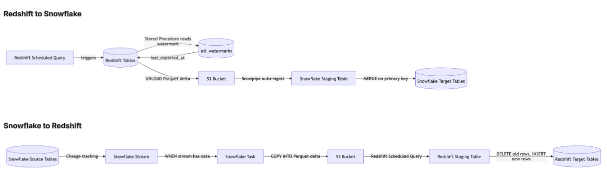

# Redshift ↔ Snowflake Bidirectional Integration: Implementation Guide

## Overview

This guide covers a bidirectional data integration between AWS Redshift and Snowflake using
S3 as the interchange layer. No Airflow, Step Functions, or third-party ETL tools are required.



### Assumptions

| | Redshift → Snowflake | Snowflake → Redshift |
|---|---|---|
| Number of tables | 15 | 1 |
| Initial bulk load | ~10M rows per table | ~2M rows |
| Ongoing | Incremental (changed rows only) | Incremental (CDC via stream) |
| Sync frequency | Weekly | Weekly |

The watermark-based incremental procedure on the Redshift side means only rows changed since
the last run are exported — not the full 10M rows — after the initial bulk load completes.
Similarly, the Snowflake stream only captures changed rows after the initial task execution.

**Two independent data flows:**

| Direction | Source Table | Target Table | Trigger |
|---|---|---|---|
| Redshift → Snowflake | `shipments` (Redshift) | `shipments` (Snowflake) | Redshift Stored Procedure + Scheduler |
| Snowflake → Redshift | `inventory_forecast` (Snowflake) | `inventory_forecast` (Redshift) | Snowflake Stream + Task (CDC) |

**Ownership boundary:** Each system owns its source table. Neither system writes to the
other's source — conflict-free by design.

> **Note on table names:** This guide uses `shipments` and `inventory_forecast` as example
> table names. Replace these with your own table names throughout.

---

## Prerequisites

Before starting, fill in these values for your environment. They are referenced throughout
this guide as placeholders in `< >`.

### AWS

| Placeholder | Description | Where to Find |
|---|---|---|
| `<your-aws-account-id>` | 12-digit AWS account number | AWS console top-right menu |
| `<your-aws-region>` | AWS region for all resources | e.g. `us-east-1` |
| `<your-redshift-cluster>` | Redshift cluster identifier | Redshift console |
| `<your-redshift-database>` | Database name inside the cluster | e.g. `dev` or `prod` |
| `<your-db-user>` | Redshift user for Data API calls | e.g. `admin` |
| `<your-s3-bucket>` | S3 bucket used as the interchange layer | S3 console |
| `<your-redshift-s3-role>` | IAM role name attached to Redshift cluster | IAM console |
| `<your-eventbridge-role>` | IAM role name for EventBridge Scheduler | IAM console (created in this guide) |
| `<your-scheduler-name>` | EventBridge Scheduler name | Your choice, e.g. `redshift-incremental-export` |

### Snowflake

| Placeholder | Description | Where to Find |
|---|---|---|
| `<your-snowflake-account>` | Snowflake account identifier | Admin → Accounts |
| `<your-snowflake-database>` | Target database | e.g. `ANALYTICS_DB` |
| `<your-snowflake-schema>` | Target schema | e.g. `REDSHIFT_INTEGRATION` |
| `<your-snowflake-role>` | Role used for setup | e.g. `SYSADMIN` |
| `<your-snowflake-warehouse>` | Warehouse for task execution | e.g. `COMPUTE_WH` |
| `<your-storage-integration>` | Storage integration name | Your choice, e.g. `s3_integration` |
| `<your-stage>` | External stage name | Your choice, e.g. `s3_stage` |
| `<snowflake-iam-user-arn>` | Snowflake's IAM user ARN | `DESC INTEGRATION <your-storage-integration>` |
| `<snowflake-external-id>` | Snowflake external ID for trust | `DESC INTEGRATION <your-storage-integration>` |
| `<sqs-arn-from-show-pipes>` | SQS ARN for Snowpipe auto-ingest | `SHOW PIPES` after creating the pipe |

### S3 Path Convention

This guide uses the following S3 path structure. Adjust the prefix to match your naming conventions.

| Path | Purpose |
|---|---|
| `s3://<your-s3-bucket>/redshift-to-snowflake/shipments/<timestamp>/` | Incremental UNLOAD from Redshift |
| `s3://<your-s3-bucket>/redshift-to-snowflake/shipments_bulk/` | One-time bulk export from Redshift |
| `s3://<your-s3-bucket>/snowflake-to-redshift/inventory_forecast/` | Stream export from Snowflake |

---

## Flow 1: Redshift → Snowflake (`shipments`)

### Architecture

```
Redshift: shipments
    │
    │  UNLOAD delta (updated_at > watermark)
    ▼
S3: redshift-to-snowflake/shipments/<YYYY-MM-DD-HH24MISS>/
    │
    │  Snowpipe AUTO_INGEST (SQS event notification)
    ▼
Snowflake: shipments_staging
    │
    │  MERGE with ROW_NUMBER() dedup
    ▼
Snowflake: shipments (target)

Scheduler ──► CALL export_shipments_incremental()
```

### Redshift Objects

#### Watermark tracking table

```sql
CREATE TABLE IF NOT EXISTS etl_watermarks (
    table_name       VARCHAR(255),
    last_exported_at TIMESTAMP,
    updated_at       TIMESTAMP DEFAULT SYSDATE
);

-- Initialize once before first run.
-- Set to a date before your earliest data to capture full history on first run.
INSERT INTO etl_watermarks (table_name, last_exported_at)
VALUES ('shipments', '2020-01-01 00:00:00');
```

#### Source table

```sql
CREATE TABLE IF NOT EXISTS shipments (
    shipment_id        INT,
    order_id           VARCHAR(20),
    supplier_id        VARCHAR(20),
    origin_warehouse   VARCHAR(50),
    destination        VARCHAR(100),
    carrier            VARCHAR(50),
    status             VARCHAR(20),
    ship_date          DATE,
    estimated_arrival  DATE,
    actual_arrival     DATE,
    quantity           INT,
    weight_kg          DECIMAL(8,2),
    updated_at         TIMESTAMP DEFAULT SYSDATE
);
```

#### Stored procedure for incremental UNLOAD

```sql
CREATE OR REPLACE PROCEDURE export_shipments_incremental()
AS $$
DECLARE
    v_last_run TIMESTAMP;
    v_this_run TIMESTAMP;
    v_ts_path  VARCHAR(50);
    v_sql      VARCHAR(65535);
BEGIN
    -- Capture current time at START of run (not end).
    -- This ensures rows written mid-export are not missed next run.
    v_this_run := SYSDATE;

    -- Build timestamp string for S3 path (makes every run unique).
    v_ts_path  := TO_CHAR(v_this_run, 'YYYY-MM-DD-HH24MISS');

    -- Read last successful export timestamp.
    SELECT last_exported_at INTO v_last_run
    FROM etl_watermarks
    WHERE table_name = 'shipments';

    -- Build and execute incremental UNLOAD.
    v_sql := 'UNLOAD (''SELECT * FROM shipments WHERE updated_at > ''''' || v_last_run || ''''''')
              TO ''s3://<your-s3-bucket>/redshift-to-snowflake/shipments/' || v_ts_path || '/''
              IAM_ROLE ''arn:aws:iam::<your-aws-account-id>:role/<your-redshift-s3-role>''
              FORMAT AS PARQUET ALLOWOVERWRITE';

    EXECUTE v_sql;

    -- Update watermark only after successful UNLOAD.
    -- If the procedure fails, watermark stays at the last checkpoint.
    UPDATE etl_watermarks
    SET last_exported_at = v_this_run,
        updated_at       = SYSDATE
    WHERE table_name = 'shipments';
END;
$$ LANGUAGE plpgsql;
```

> **Why timestamped S3 paths?** Snowpipe deduplicates by filename. If the procedure always
> writes to `shipments/0000_part_00.parquet`, Snowpipe skips it after the first ingest.
> Writing to `shipments/2026-04-24-000119/0000_part_00.parquet` makes every run produce
> a unique path that Snowpipe always ingests.

#### Bulk UNLOAD (Phase 1 — run once)

```sql
UNLOAD ('SELECT * FROM shipments')
TO 's3://<your-s3-bucket>/redshift-to-snowflake/shipments_bulk/'
IAM_ROLE 'arn:aws:iam::<your-aws-account-id>:role/<your-redshift-s3-role>'
FORMAT AS PARQUET
ALLOWOVERWRITE;

-- Reset watermark after bulk load so incremental runs only pick up new rows.
UPDATE etl_watermarks
SET last_exported_at = SYSDATE,
    updated_at       = SYSDATE
WHERE table_name = 'shipments';
```

### Snowflake Objects

#### Tables

```sql
-- Target table (receives from Redshift)
CREATE OR REPLACE TABLE <your-snowflake-database>.<your-snowflake-schema>.shipments (
    shipment_id       NUMBER,
    order_id          VARCHAR(20),
    supplier_id       VARCHAR(20),
    origin_warehouse  VARCHAR(50),
    destination       VARCHAR(100),
    carrier           VARCHAR(50),
    status            VARCHAR(20),
    ship_date         DATE,
    estimated_arrival DATE,
    actual_arrival    DATE,
    quantity          NUMBER,
    weight_kg         NUMBER(8,2),
    updated_at        TIMESTAMP_NTZ
);

-- Staging table for Snowpipe ingest (identical schema to target)
CREATE OR REPLACE TABLE <your-snowflake-database>.<your-snowflake-schema>.shipments_staging (
    shipment_id       NUMBER,
    order_id          VARCHAR(20),
    supplier_id       VARCHAR(20),
    origin_warehouse  VARCHAR(50),
    destination       VARCHAR(100),
    carrier           VARCHAR(50),
    status            VARCHAR(20),
    ship_date         DATE,
    estimated_arrival DATE,
    actual_arrival    DATE,
    quantity          NUMBER,
    weight_kg         NUMBER(8,2),
    updated_at        TIMESTAMP_NTZ
);
```

#### Snowpipe

```sql
CREATE OR REPLACE PIPE <your-snowflake-database>.<your-snowflake-schema>.shipments_pipe
  AUTO_INGEST = TRUE
AS
COPY INTO <your-snowflake-database>.<your-snowflake-schema>.shipments_staging
FROM @<your-snowflake-database>.<your-snowflake-schema>.<your-stage>/redshift-to-snowflake/shipments/
FILE_FORMAT = (TYPE = PARQUET)
MATCH_BY_COLUMN_NAME = CASE_INSENSITIVE;

-- Retrieve SQS ARN — needed for S3 event notification setup (next step)
SHOW PIPES LIKE 'shipments_pipe' IN SCHEMA <your-snowflake-database>.<your-snowflake-schema>;
-- Copy the value in the notification_channel column: <sqs-arn-from-show-pipes>
```

After creating the pipe, configure S3 to notify Snowpipe when new files arrive:

1. Go to the **S3 console** → open `<your-s3-bucket>` → **Properties** tab
2. Scroll to **Event notifications** → click **Create event notification**
3. Fill in:
   - **Event name:** anything descriptive, e.g. `snowpipe-shipments-trigger`
   - **Prefix:** `redshift-to-snowflake/shipments/` (must match the pipe's S3 path exactly)
   - **Event types:** check `s3:ObjectCreated:*`
   - **Destination:** select **SQS queue** → **Enter SQS queue ARN** → paste the ARN from `SHOW PIPES`
4. Click **Save changes**

To verify: UNLOAD a file to the prefix and check Snowpipe ingest history in Snowflake:
```sql
SELECT * FROM TABLE(INFORMATION_SCHEMA.COPY_HISTORY(
    TABLE_NAME => 'shipments_staging',
    START_TIME => DATEADD('hour', -1, CURRENT_TIMESTAMP)
));
```

#### Bulk COPY (Phase 1 — run once)

```sql
-- Copy directly into the TARGET table (not staging).
-- The bulk Parquet has no METADATA$ columns — staging schema matches, but
-- keeping bulk loads in the target avoids confusion with the incremental flow.
COPY INTO <your-snowflake-database>.<your-snowflake-schema>.shipments
FROM @<your-snowflake-database>.<your-snowflake-schema>.<your-stage>/redshift-to-snowflake/shipments_bulk/
FILE_FORMAT = (TYPE = PARQUET)
MATCH_BY_COLUMN_NAME = CASE_INSENSITIVE;
```

#### Incremental MERGE (run after each Snowpipe batch)

```sql
MERGE INTO <your-snowflake-database>.<your-snowflake-schema>.shipments AS tgt
USING (
    SELECT * FROM (
        SELECT *,
               ROW_NUMBER() OVER (PARTITION BY shipment_id ORDER BY updated_at DESC) AS rn
        FROM <your-snowflake-database>.<your-snowflake-schema>.shipments_staging
    ) WHERE rn = 1
) AS src
ON tgt.shipment_id = src.shipment_id
WHEN MATCHED THEN UPDATE SET
    order_id          = src.order_id,
    status            = src.status,
    actual_arrival    = src.actual_arrival,
    updated_at        = src.updated_at
WHEN NOT MATCHED THEN INSERT
    (shipment_id, order_id, supplier_id, origin_warehouse, destination, carrier, status,
     ship_date, estimated_arrival, actual_arrival, quantity, weight_kg, updated_at)
VALUES
    (src.shipment_id, src.order_id, src.supplier_id, src.origin_warehouse, src.destination,
     src.carrier, src.status, src.ship_date, src.estimated_arrival, src.actual_arrival,
     src.quantity, src.weight_kg, src.updated_at);
```

> `ROW_NUMBER()` deduplication is required because Snowpipe may ingest the same row
> multiple times if incremental windows overlap. Without it, Snowflake throws
> "Duplicate row detected during DML action".
>
> **Adapting this MERGE for your table:** Two things need to change:
> 1. Replace `shipment_id` in `PARTITION BY` and the `ON` clause with your table's primary key column
> 2. In `WHEN MATCHED UPDATE SET`, list only the columns that can change on your table —
>    omit immutable columns like IDs and `created_at`
>
> The structure of the MERGE itself (the `ROW_NUMBER()` wrapper, `WHEN MATCHED / WHEN NOT MATCHED`) is the same for every table.

### Scheduling the Stored Procedure

**Option A — Redshift Query Editor v2 (recommended, no IAM setup required):**
1. Open Query Editor v2 in the Redshift console
2. Write: `CALL export_shipments_incremental();`
3. Save the query
4. Click **Schedule** → set frequency → save

**Option B — EventBridge Scheduler (CLI):**

```bash
# Step 1: Create IAM role for EventBridge to call the Redshift Data API
aws iam create-role \
  --role-name <your-eventbridge-role> \
  --assume-role-policy-document '{
    "Version": "2012-10-17",
    "Statement": [{
      "Effect": "Allow",
      "Principal": {"Service": "scheduler.amazonaws.com"},
      "Action": "sts:AssumeRole",
      "Condition": {
        "StringEquals": {"aws:SourceAccount": "<your-aws-account-id>"}
      }
    }]
  }'

# IMPORTANT: The aws:SourceAccount condition is required.
# Without it, the scheduler is created successfully but fires 0 invocations.

# Step 2: Attach permission to call Redshift Data API
aws iam put-role-policy \
  --role-name <your-eventbridge-role> \
  --policy-name redshift-data-invoke \
  --policy-document '{
    "Version": "2012-10-17",
    "Statement": [{
      "Effect": "Allow",
      "Action": [
        "redshift-data:ExecuteStatement",
        "redshift:GetClusterCredentials"
      ],
      "Resource": "*"
    }]
  }'

# Step 3: Create the schedule (adjust rate or cron as needed)
aws scheduler create-schedule \
  --name <your-scheduler-name> \
  --schedule-expression "cron(0 6 ? * MON *)" \
  --flexible-time-window '{"Mode": "OFF"}' \
  --target '{
    "Arn": "arn:aws:scheduler:::aws-sdk:redshiftdata:executeStatement",
    "RoleArn": "arn:aws:iam::<your-aws-account-id>:role/<your-eventbridge-role>",
    "Input": "{\"ClusterIdentifier\":\"<your-redshift-cluster>\",\"Database\":\"<your-redshift-database>\",\"DbUser\":\"<your-db-user>\",\"Sql\":\"CALL export_shipments_incremental();\"}"
  }' \
  --region <your-aws-region>
```

---

## Flow 2: Snowflake → Redshift (`inventory_forecast`)

> **Alternative approach:** Instead of Snowflake Streams (CDC), some teams use a watermark
> pattern symmetric with Flow 1 — Redshift stores a `last_exported_at` timestamp per table,
> Snowflake queries `WHERE updated_at > watermark` and UNLOADs to S3, Redshift COPYs in.
> This is simpler and consistent with the Redshift → Snowflake pattern, but does not capture
> deletes. If your tables are append/update only with no row deletions, this may be the
> better choice. The stream-based approach below handles all change types including deletes.

### Architecture

```
Snowflake: inventory_forecast
    │
    │  Change data capture
    ▼
Snowflake: inventory_forecast_stream
    │
    │  WHEN SYSTEM$STREAM_HAS_DATA() (weekly cron)
    ▼
export_inventory_forecast_task
    │
    │  COPY INTO Parquet (OVERWRITE=TRUE, explicit type casts, aliased METADATA$ columns)
    ▼
S3: snowflake-to-redshift/inventory_forecast/
    │
    │  Redshift scheduled COPY (runs shortly after task)
    ▼
Redshift: inventory_forecast_staging (raw CDC rows)
    │
    │  DELETE old/updated rows, INSERT new rows → target
    ▼
Redshift: inventory_forecast (target, business columns only)
```

### Snowflake Objects

#### Source table

```sql
CREATE OR REPLACE TABLE <your-snowflake-database>.<your-snowflake-schema>.inventory_forecast (
    forecast_id      NUMBER,
    sku_id           VARCHAR(20),
    product_name     VARCHAR(100),
    warehouse_id     VARCHAR(20),
    forecast_date    DATE,
    forecasted_qty   NUMBER,
    actual_qty       NUMBER,
    confidence_score NUMBER(5,4),
    model_version    VARCHAR(20),
    updated_at       TIMESTAMP_NTZ
);
```

#### Stream

```sql
CREATE OR REPLACE STREAM <your-snowflake-database>.<your-snowflake-schema>.inventory_forecast_stream
  ON TABLE <your-snowflake-database>.<your-snowflake-schema>.inventory_forecast
  APPEND_ONLY = FALSE;
```

`APPEND_ONLY = FALSE` captures inserts, updates, AND deletes. Updates appear as two rows:
a `DELETE` (old values) followed by an `INSERT` (new values).

The stream adds 3 metadata columns that must be carried through to the Redshift target:

| Column | Values | Meaning |
|---|---|---|
| `METADATA$ACTION` | `INSERT` / `DELETE` | Type of change |
| `METADATA$ISUPDATE` | `TRUE` / `FALSE` | Part of an update operation |
| `METADATA$ROW_ID` | string | Unique internal row identifier |

#### Task

```sql
CREATE OR REPLACE TASK <your-snowflake-database>.<your-snowflake-schema>.export_inventory_forecast_task
  WAREHOUSE = <your-snowflake-warehouse>
  SCHEDULE  = 'USING CRON 0 * * * * UTC'   -- hourly; adjust for production
WHEN
  SYSTEM$STREAM_HAS_DATA('<your-snowflake-database>.<your-snowflake-schema>.inventory_forecast_stream')
AS
COPY INTO @<your-snowflake-database>.<your-snowflake-schema>.<your-stage>/snowflake-to-redshift/inventory_forecast/
FROM (
    SELECT
        forecast_id::BIGINT           AS forecast_id,
        sku_id::VARCHAR(20)           AS sku_id,
        product_name::VARCHAR(100)    AS product_name,
        warehouse_id::VARCHAR(20)     AS warehouse_id,
        forecast_date::TIMESTAMP_NTZ  AS forecast_date,
        forecasted_qty::BIGINT        AS forecasted_qty,
        actual_qty::BIGINT            AS actual_qty,
        confidence_score::NUMBER(5,4) AS confidence_score,
        model_version::VARCHAR(20)    AS model_version,
        updated_at::TIMESTAMP_NTZ     AS updated_at,
        METADATA$ACTION               AS metadata_action,
        METADATA$ISUPDATE             AS metadata_isupdate,
        METADATA$ROW_ID               AS metadata_row_id
    FROM <your-snowflake-database>.<your-snowflake-schema>.inventory_forecast_stream
)
FILE_FORMAT = (TYPE = PARQUET)
OVERWRITE   = TRUE
HEADER      = TRUE;

-- Tasks are suspended by default after creation — resume before use
ALTER TASK <your-snowflake-database>.<your-snowflake-schema>.export_inventory_forecast_task RESUME;

-- Manually trigger for testing (bypasses the schedule)
EXECUTE TASK <your-snowflake-database>.<your-snowflake-schema>.export_inventory_forecast_task;
```

> **Why explicit type casts?** Snowflake `NUMBER` columns write as `decimal128(38,0)` in Parquet.
> Redshift cannot load `decimal128(38,0)` into `BIGINT` or `INT` columns — it throws a schema
> incompatibility error. Casting to `::BIGINT` in the task SELECT writes `int64` in Parquet,
> which Redshift accepts for `BIGINT` columns. See the type mapping table below.
>
> **Why alias METADATA$ columns?** The `$` character in `METADATA$ACTION` is not valid in
> Redshift column names. Aliasing as `metadata_action` (no `$`) resolves this.
>
> **Why `OVERWRITE = TRUE`?** The task writes to a fixed S3 path on every run. Without
> `OVERWRITE = TRUE`, Snowflake rejects the COPY if files already exist at the destination.

#### Bulk load (Phase 1 — run once)

After inserting your initial data, execute the task manually. The stream captures the initial
inserts and the task writes them to S3.

```sql
EXECUTE TASK <your-snowflake-database>.<your-snowflake-schema>.export_inventory_forecast_task;
```

### Redshift Objects

#### Target table

```sql
-- IMPORTANT: Use BIGINT for integer columns (see type mapping section).
-- IMPORTANT: Include all three metadata columns — the Parquet always contains them.
CREATE TABLE IF NOT EXISTS inventory_forecast (
    forecast_id        BIGINT,
    sku_id             VARCHAR(20),
    product_name       VARCHAR(100),
    warehouse_id       VARCHAR(20),
    forecast_date      TIMESTAMP,
    forecasted_qty     BIGINT,
    actual_qty         BIGINT,
    confidence_score   DECIMAL(5,4),
    model_version      VARCHAR(20),
    updated_at         TIMESTAMP,
    metadata_action    VARCHAR(10),
    metadata_isupdate  BOOLEAN,
    metadata_row_id    VARCHAR(100)
);
```

#### Staging table

> **Note on implementation:** The staging + DELETE+INSERT pattern below is the recommended
> production approach for keeping Redshift as an exact mirror of Snowflake. For initial
> testing and validation, a simple `COPY` directly into the target table is sufficient —
> but it will not correctly handle updates or deletes, and the target table will include
> the three metadata columns. Switch to the full pattern below before going to production.

For production, create a staging table with the same schema as the target (including
the three metadata columns). The staging table acts as a landing zone for the raw CDC
Parquet — the target table stays clean with business columns only after applying changes.

```sql
CREATE TABLE IF NOT EXISTS inventory_forecast_staging (
    forecast_id        BIGINT,
    sku_id             VARCHAR(20),
    product_name       VARCHAR(100),
    warehouse_id       VARCHAR(20),
    forecast_date      TIMESTAMP,
    forecasted_qty     BIGINT,
    actual_qty         BIGINT,
    confidence_score   DECIMAL(5,4),
    model_version      VARCHAR(20),
    updated_at         TIMESTAMP,
    metadata_action    VARCHAR(10),
    metadata_isupdate  BOOLEAN,
    metadata_row_id    VARCHAR(100)
);
```

#### COPY and apply changes

```sql
-- Step 1: Load CDC delta into staging
COPY inventory_forecast_staging
FROM 's3://<your-s3-bucket>/snowflake-to-redshift/inventory_forecast/'
IAM_ROLE 'arn:aws:iam::<your-aws-account-id>:role/<your-redshift-s3-role>'
FORMAT AS PARQUET;

-- Step 2: Remove deleted and updated rows from target
-- (Snowflake streams represent updates as a DELETE row + INSERT row pair,
-- so this handles both deletes and the old version of updates)
DELETE FROM inventory_forecast
USING inventory_forecast_staging s
WHERE inventory_forecast.forecast_id = s.forecast_id
  AND s.metadata_action = 'DELETE';

-- Step 3: Insert new and updated rows into target
-- (business columns only — metadata columns stay in staging, not in target)
INSERT INTO inventory_forecast
    (forecast_id, sku_id, product_name, warehouse_id, forecast_date,
     forecasted_qty, actual_qty, confidence_score, model_version, updated_at)
SELECT
    forecast_id, sku_id, product_name, warehouse_id, forecast_date,
    forecasted_qty, actual_qty, confidence_score, model_version, updated_at
FROM inventory_forecast_staging
WHERE metadata_action = 'INSERT';
```

> **Why DELETE + INSERT instead of UPDATE?** Snowflake streams do not emit UPDATE rows.
> An update in Snowflake produces two rows in the stream: a `DELETE` with the old values
> and an `INSERT` with the new values. Processing all DELETEs then all INSERTs applies
> updates correctly without needing a SQL UPDATE statement.
>
> **Scheduling:** Run this COPY + apply block on the same cadence as the Snowflake task
> (or shortly after) using a Redshift stored procedure scheduled via Query Editor v2 or
> EventBridge Scheduler. If the Snowflake task skipped that week (no new data), the S3
> file is unchanged and re-processing it is harmless — DELETE finds no matching rows to
> remove and INSERT re-applies rows that already exist, which can be guarded with a
> `WHERE NOT EXISTS` check if needed.

---

## IAM Configuration

### Redshift → S3 (`<your-redshift-s3-role>`)

**Trust policy** — allows Redshift to assume this role:
```json
{
  "Version": "2012-10-17",
  "Statement": [{
    "Effect": "Allow",
    "Principal": {"Service": "redshift.amazonaws.com"},
    "Action": "sts:AssumeRole"
  }]
}
```

**Permission policy** — S3 read/write on the interchange bucket:
```json
{
  "Version": "2012-10-17",
  "Statement": [{
    "Effect": "Allow",
    "Action": ["s3:GetObject", "s3:PutObject", "s3:ListBucket", "s3:DeleteObject"],
    "Resource": [
      "arn:aws:s3:::<your-s3-bucket>",
      "arn:aws:s3:::<your-s3-bucket>/*"
    ]
  }]
}
```

After creating the role, attach it to your Redshift cluster under **Properties → IAM roles**.

### Snowflake → S3 (Storage Integration role)

**Step 1 — Create the Storage Integration in Snowflake:**

```sql
CREATE OR REPLACE STORAGE INTEGRATION <your-storage-integration>
  TYPE = EXTERNAL_STAGE
  STORAGE_PROVIDER = 'S3'
  ENABLED = TRUE
  STORAGE_AWS_ROLE_ARN = 'arn:aws:iam::<your-aws-account-id>:role/<your-snowflake-s3-role>'
  STORAGE_ALLOWED_LOCATIONS = ('s3://<your-s3-bucket>/');

-- Retrieve the values needed for the IAM trust policy
DESC INTEGRATION <your-storage-integration>;
-- Copy: STORAGE_AWS_IAM_USER_ARN  → <snowflake-iam-user-arn>
-- Copy: STORAGE_AWS_EXTERNAL_ID   → <snowflake-external-id>
```

**Step 2 — Create the IAM role with the values from DESC INTEGRATION:**

**Trust policy:**
```json
{
  "Version": "2012-10-17",
  "Statement": [{
    "Effect": "Allow",
    "Principal": {
      "AWS": "<snowflake-iam-user-arn>"
    },
    "Action": "sts:AssumeRole",
    "Condition": {
      "StringEquals": {
        "sts:ExternalId": "<snowflake-external-id>"
      }
    }
  }]
}
```

**Permission policy** — same S3 read/write as above, scoped to your bucket.

> If you ever recreate the Storage Integration, the `STORAGE_AWS_EXTERNAL_ID` changes.
> Update the IAM trust policy with the new value or Snowflake will lose S3 access.

**Step 3 — Create the external stage:**

```sql
CREATE OR REPLACE STAGE <your-snowflake-database>.<your-snowflake-schema>.<your-stage>
  URL = 's3://<your-s3-bucket>/'
  STORAGE_INTEGRATION = <your-storage-integration>
  FILE_FORMAT = (TYPE = PARQUET);
```

### EventBridge Scheduler (`<your-eventbridge-role>`)

**Trust policy** — `aws:SourceAccount` is mandatory:
```json
{
  "Version": "2012-10-17",
  "Statement": [{
    "Effect": "Allow",
    "Principal": {"Service": "scheduler.amazonaws.com"},
    "Action": "sts:AssumeRole",
    "Condition": {
      "StringEquals": {"aws:SourceAccount": "<your-aws-account-id>"}
    }
  }]
}
```

> Without `aws:SourceAccount`, the schedule appears healthy in the console
> but fires zero invocations. This is the most common scheduler setup mistake.

**Permission policy:**
```json
{
  "Version": "2012-10-17",
  "Statement": [{
    "Effect": "Allow",
    "Action": [
      "redshift-data:ExecuteStatement",
      "redshift:GetClusterCredentials"
    ],
    "Resource": "*"
  }]
}
```

---

## Type Mapping: Snowflake → Redshift via Parquet

This is the most common source of `COPY` failures when moving data from Snowflake to Redshift.
Reference this table when designing tasks for any table.

| Snowflake Type | Parquet Type Written | Redshift Compatible Type | Notes |
|---|---|---|---|
| `NUMBER` / `NUMBER(p,0)` | `decimal128(38,0)` | `DECIMAL(38,0)` | Or cast `::BIGINT` → writes `int64` |
| `NUMBER` cast `::BIGINT` | `int64` | `BIGINT` | Preferred for integer IDs and counts |
| `NUMBER(p,s)` where s>0 | `decimal128(p,s)` | `DECIMAL(p,s)` | Match precision and scale exactly |
| `VARCHAR` | `byte_array` (UTF-8) | `VARCHAR(n)` | Compatible directly |
| `TIMESTAMP_NTZ` | `timestamp[ms, tz=UTC]` | `TIMESTAMP` | Compatible directly |
| `DATE` | `date32` | `DATE` | Compatible directly |
| `BOOLEAN` | `bool` | `BOOLEAN` | Compatible directly |

**Key rule:** Any Snowflake `NUMBER` that should land in a Redshift integer column (`INT`,
`BIGINT`, `SMALLINT`) must be explicitly cast in the task SELECT:

```sql
-- In task SELECT — forces int64 Parquet output instead of decimal128
some_id::BIGINT    AS some_id,
some_count::BIGINT AS some_count
```

---

## Verification Checklist

### Flow 1: Redshift → Snowflake (shipments)

```sql
-- 1. Confirm watermark is advancing after each run (Redshift)
SELECT * FROM etl_watermarks WHERE table_name = 'shipments';

-- 2. Confirm UNLOAD wrote a new timestamped file (AWS CLI)
-- aws s3 ls s3://<your-s3-bucket>/redshift-to-snowflake/shipments/ --recursive

-- 3. Confirm Snowpipe ingested the file (Snowflake)
SELECT * FROM TABLE(INFORMATION_SCHEMA.COPY_HISTORY(
    TABLE_NAME => 'shipments_staging',
    START_TIME => DATEADD('hour', -1, CURRENT_TIMESTAMP)
));

-- 4. Confirm staging has the new rows
SELECT shipment_id, order_id, carrier, status
FROM <your-snowflake-database>.<your-snowflake-schema>.shipments_staging
ORDER BY shipment_id DESC LIMIT 5;

-- 5. Run MERGE, then verify target count
SELECT COUNT(*) FROM <your-snowflake-database>.<your-snowflake-schema>.shipments;
```

### Flow 2: Snowflake → Redshift (inventory_forecast)

```sql
-- 1. Confirm stream has pending data after an insert/update (Snowflake)
SELECT SYSTEM$STREAM_HAS_DATA(
    '<your-snowflake-database>.<your-snowflake-schema>.inventory_forecast_stream'
);

-- 2. Check task run history (Snowflake)
SELECT name, state, error_message, scheduled_time, completed_time
FROM TABLE(INFORMATION_SCHEMA.TASK_HISTORY(
    TASK_NAME => 'export_inventory_forecast_task',
    SCHEDULED_TIME_RANGE_START => DATEADD('hour', -24, CURRENT_TIMESTAMP)
))
ORDER BY scheduled_time DESC LIMIT 5;

-- 3. Confirm task wrote a Parquet file to S3 (AWS CLI)
-- aws s3 ls s3://<your-s3-bucket>/snowflake-to-redshift/inventory_forecast/

-- 4. Verify rows landed in Redshift
-- SELECT COUNT(*) FROM inventory_forecast;
-- SELECT forecast_id, sku_id, metadata_action FROM inventory_forecast ORDER BY forecast_id DESC LIMIT 5;
```

---

## Phase-by-Phase Setup Order

Follow this order for a clean first deployment.

### AWS Setup (one-time)

1. Create S3 bucket `<your-s3-bucket>`
2. Create IAM role `<your-redshift-s3-role>` (trust: `redshift.amazonaws.com`, permissions: S3 read/write on the bucket)
3. Attach `<your-redshift-s3-role>` to the Redshift cluster

### Snowflake Setup (one-time)

4. Create Storage Integration `<your-storage-integration>`
5. Run `DESC INTEGRATION <your-storage-integration>` → copy `STORAGE_AWS_IAM_USER_ARN` and `STORAGE_AWS_EXTERNAL_ID`
6. Create IAM role for Snowflake S3 access using the ARN and ExternalId from step 5
7. Create external stage `<your-stage>` pointing at the S3 bucket

### S3 Event Notification (one-time)

8. Create Snowpipe `shipments_pipe` → run `SHOW PIPES` → copy the `notification_channel` SQS ARN
9. In the S3 console, add an event notification on the bucket:
   prefix = `redshift-to-snowflake/shipments/`, destination = SQS ARN from step 8

### Redshift Schema Setup (one-time)

10. Create `etl_watermarks` and insert the `shipments` row
11. Create `shipments` source table
12. Create `inventory_forecast` target table — **include all three metadata columns**
13. Create `export_shipments_incremental()` stored procedure

### Snowflake Schema Setup (one-time)

14. Create `shipments` target table and `shipments_staging` table
15. Create `inventory_forecast` source table
16. Create `inventory_forecast_stream` on the source table
17. Create and resume `export_inventory_forecast_task`

### Phase 1: Bulk Load (run once)

18. Redshift: UNLOAD full `shipments` table to the `_bulk/` S3 prefix
19. Snowflake: COPY bulk file into `shipments` target table
20. Snowflake: Insert seed data into `inventory_forecast` → `EXECUTE TASK` manually
21. Redshift: COPY from `snowflake-to-redshift/inventory_forecast/`
22. Reset the Redshift watermark: `UPDATE etl_watermarks SET last_exported_at = SYSDATE WHERE table_name = 'shipments'`

### Phase 2: Incremental (ongoing)

23. Scheduler fires `CALL export_shipments_incremental()` on your configured cadence
24. Snowpipe auto-ingests new Parquet files into `shipments_staging`
25. Run MERGE after each Snowpipe batch to upsert staging into the target
26. `inventory_forecast_stream` feeds `export_inventory_forecast_task` hourly
27. After the task fires, run the Redshift COPY to pull the latest Parquet
